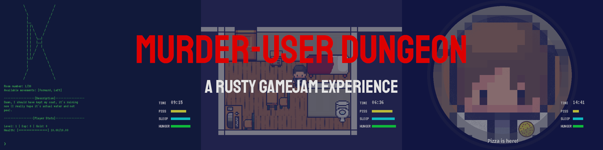
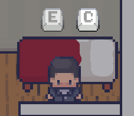
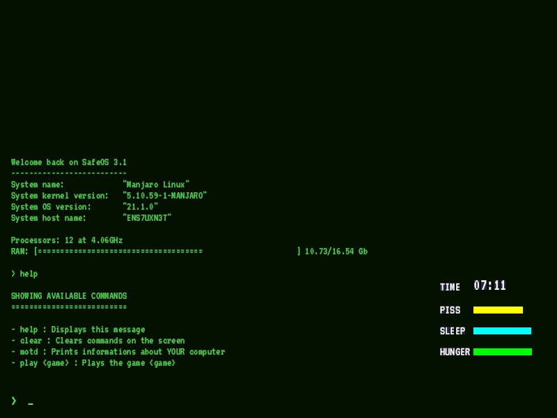
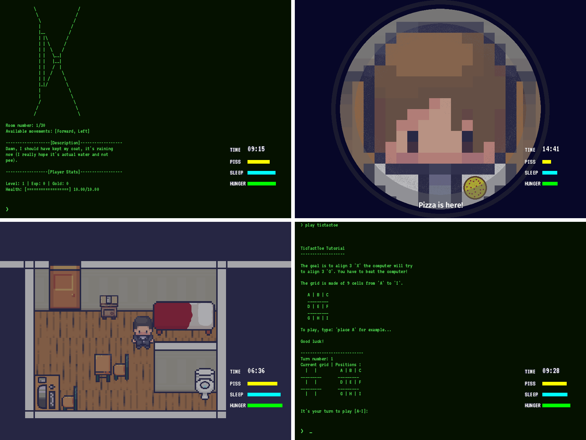
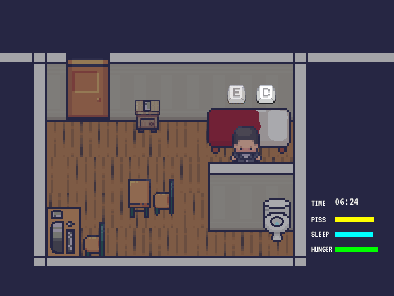
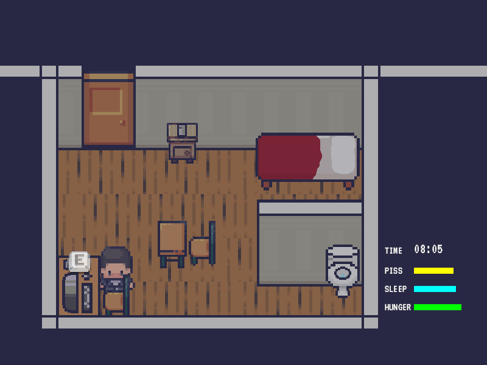

# Murder-User Dungeon

## Introduction

Tony is a young man. Finally having its own apartment is a good thing! He will learn how to live by himself and how to enjoy the small things in life like playing on his old retro computer: the Astaria 3600 running SafeOS 3.1.

However, you will quickly realize that the internet is not so friendly. While you will meet new people in the Labyrinth(TM) game, not being friendly to them can have a serious impact on your real life!

Juggling between playing the game, hiding from vengeful gamers, and making sure you fulfill your needs, you may find the final boss of the Labyrinth(TM) beat it and win the game!

## How to play

You can move the character using either :

-   **WASD** - for the people lucky enough to live in a country using a standardized keyboard layout
-   **The arrow keys** - for the rest of us (including myself)

Once close enough to something you can interact with you can either press "**E**" or "**C**" depending on the action and whether this action is available:

In order to win the game, the player will have to go to the PC and play some games. We suggest you start with **TicTacToe** before continuing to the **real** game: **Labyrinth** (TM).

If you don't know which command is available you can always type help in the console to print some help.

To close the console, press the **Escape** key on the keyboard.

Don't forget that if you make enemies in the game, they will try to **reach you in real life**! If you hear someone lock-picking your door, quickly hide under the bed ("**C**" key next to the bed) and if you order pizza, always be sure it's the delivery guy and not some fricks at the door ("**C**" key at the door).

## How to win the game

You have two ways to win the game:

-   (_EASY_) Kill the boss at the end of the Labyrinth game while staying alive in the game AND the real world
-   (_HARD_) Find every death possible in the game (there is 8 of them)

## Screenshots & GIFs

## Credits

-   The Bevy Engine [https://bevyengine.org/](https://bevyengine.org/)
-   Rapier [https://rapier.rs/](https://rapier.rs/)
-   Modern Interiors [https://limezu.itch.io/](https://limezu.itch.io/)
-   Kadith's icons [https://kadith.itch.io/kadiths-free-icons](https://kadith.itch.io/kadiths-free-icons)
-   [https://freesound.org/people/Setuniman/sounds/139069/](https://freesound.org/people/Setuniman/sounds/139069/)
-   [https://freesound.org/people/InspectorJ/sounds/431117/](https://freesound.org/people/InspectorJ/sounds/431117/)
-   [https://freesound.org/people/InspectorJ/sounds/411791/](https://freesound.org/people/InspectorJ/sounds/411791/)
-   [https://freesound.org/people/avakas/sounds/172365/](https://freesound.org/people/avakas/sounds/172365/)
-   [https://freesound.org/people/Lukeo135/sounds/514091/](https://freesound.org/people/Lukeo135/sounds/514091/)
-   [https://freesound.org/people/Breviceps/sounds/466832/](https://freesound.org/people/Breviceps/sounds/466832/)

---

Made for the Rusty Jam 2021 [https://itch.io/jam/rusty-jam](https://itch.io/jam/rusty-jam) in 7 days by TheRealTeamFReSh:

    Nightlyside - [https://nightlyside.github.io](https://nightlyside.github.io)
    Sheepyhead - [https://github.com/Sheepyhead](https://github.com/Sheepyhead)
    cdsupina - [https://github.com/cdsupina](https://github.com/cdsupina)

The project is under the double license MIT/Apache, same goes for the assets. You can check the licensing here: [https://github.com/TheRealTeamFReSh/RustyJam/blob/master/LICENSE](https://github.com/TheRealTeamFReSh/RustyJam/blob/master/LICENSE)

> **Disclaimer**: This project was put together in only 7 days, we do not encourage you to write code like we did. It was more about duct taping rather than making a reference.
